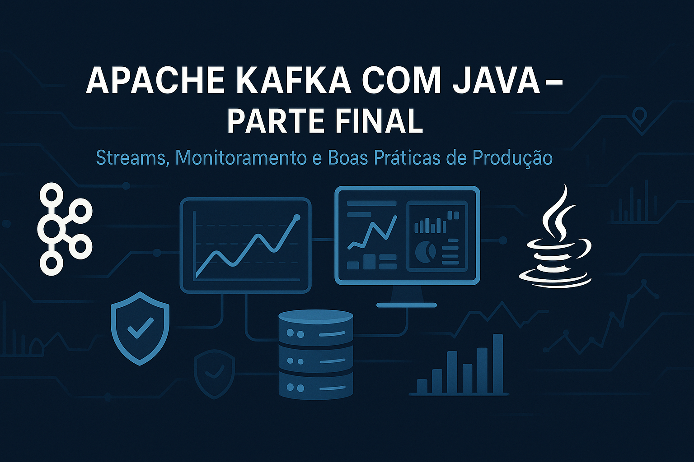

# Apache Kafka Java Mastery

Este repositório foi simplificado para facilitar o aprendizado e a consulta, focando em três partes principais:

## Estrutura do Conteúdo

- [Parte I: Fundamentos](parte1-fundamentos.md)  
    
  Conceitos essenciais do Apache Kafka, arquitetura, tópicos, partições, comandos básicos e primeiros experimentos.

- [Parte II: Java com Kafka](parte2-java.md)  
    
  Como integrar aplicações Java ao Kafka, producers, consumers, serialização, exemplos práticos, melhores práticas **e teste integrado automatizado** (Producer + Consumer) usando JUnit e Kafka real (veja `KafkaIntegrationTest.java`).

- [Parte Final: Avançado](parte-final-avancado.md)  
    
  Processamento avançado, Kafka Streams, integração com ecossistema, monitoramento, segurança e dicas para produção.

**Artefatos da Parte Final:**

- Exemplos de configuração de cluster Kafka com múltiplos brokers (`docker-compose.yml` avançado)
- Scripts de monitoramento com Prometheus e Grafana
- Arquivos de configuração de autenticação/autorização (SASL/SSL, ACLs)
- Exemplos de uso do Schema Registry (schemas Avro/Protobuf/JSON)
- Configurações de conectores para Kafka Connect
- Dashboards de monitoramento (JSON do Grafana)
- Scripts de backup/restauração e automação
- Checklists e documentação de boas práticas para produção

## Estrutura de Pastas e Arquivos

```markdown
kafka-java-mastery/
├── README.md                # Este guia principal
├── parte1-fundamentos.md    # Parte I: Fundamentos do Apache Kafka (Markdown)
├── parte1-fundamentos.html  # Parte I: Fundamentos (HTML gerado)
├── parte2-java.md           # Parte II: Java com Kafka (Markdown)
├── parte2-java.html         # Parte II: Java com Kafka (HTML gerado)
├── parte-final-avancado.md  # Parte Final: Kafka Avançado e Produção (Markdown)
├── parte-final-avancado.html# Parte Final: Kafka Avançado e Produção (HTML gerado)
├── LICENSE                  # Licença do projeto
├── img/                     # Imagens ilustrativas das partes
│   ├── kafka-java-parte1.png
│   ├── kafka-java-parte2.png
│   └── kafka-java-parte-final.png
├── parte1-fundamentos/      # Ambiente e exemplos da Parte I
│   └── docker-compose.yml   # Docker Compose para ambiente local
├── parte2-java/             # Projeto Java completo da Parte II
│   ├── docker-compose.yml   # Ambiente Kafka para testes
│   ├── pom.xml              # Dependências Maven
│   ├── src/
│   │   ├── main/java/com/mulato/
│   │   │   ├── PedidoProducer.java   # Exemplo avançado de Producer
│   │   │   └── PedidoConsumer.java   # Exemplo avançado de Consumer
│   │   └── test/java/com/mulato/
│   │       ├── PedidoProducerTest.java   # Teste unitário Producer
│   │       ├── PedidoConsumerTest.java   # Teste unitário Consumer
│   │       └── KafkaIntegrationTest.java # Teste integrado Producer+Consumer
│   └── target/                # Artefatos compilados
│       └── parte2-java-1.0-SNAPSHOT.jar
└── artefatos-final/           # Artefatos práticos da Parte Final
    ├── docker-compose-multibroker.yml    # Cluster multi-broker
    ├── monitoramento/
    │   ├── prometheus.yml                # Config Prometheus
    │   └── grafana-dashboard-example.json# Dashboard Grafana
    ├── seguranca/
    │   ├── server.properties             # Configuração de broker seguro
    │   └── exemplo-acls.txt              # Exemplo de ACLs
    ├── schema-registry/
    │   └── exemplo-schema-avro.avsc      # Exemplo de schema Avro
    ├── kafka-connect/
    │   └── exemplo-connector.json        # Exemplo de conector Kafka Connect
    ├── backup-e-automacao/
    │   └── backup-topicos.sh             # Script de backup
    └── boas-praticas/
        └── checklist-producao.md         # Checklist de produção
```

## Como usar

1. Siga a ordem das partes para evoluir do básico ao avançado.
2. Cada arquivo `.md` traz teoria, exemplos e comandos práticos.
3. Consulte o README sempre que quiser navegar entre as partes.

## Requisitos

- Java 11+ (recomendado Java 17+)
- Docker (para ambiente local)
- Git

## Licença

Este projeto está licenciado sob a MIT License.

## Recursos de Referência

- [Documentação Oficial do Apache Kafka](https://kafka.apache.org/documentation/)
- [Confluent Platform Documentation](https://docs.confluent.io/)
- [Kafka Streams Documentation](https://kafka.apache.org/documentation/streams/)
- [Spring Kafka Reference](https://docs.spring.io/spring-kafka/docs/current/reference/html/)
- [Exemplos Oficiais e Quickstart](https://kafka.apache.org/quickstart)

Esses links trazem roteiros, exemplos, dicas de prática, troubleshooting e materiais para aprofundar ou expandir o treinamento.

---

## Arquivos de Exercícios Práticos

O repositório inclui arquivos auxiliares com roteiros de exercícios, desafios práticos e espaço para anotações em cada etapa do aprendizado:

- `parte1-fundamentos/exercicios-parte1.md` — Exercícios de fundamentos, comandos básicos e experimentação inicial.
- `parte2-java/exercicios-parte2.md` — Exercícios de integração Java + Kafka, implementação de Producer/Consumer e testes.
- `parte-final-avancado/exercicios-parte-final.md` — Desafios avançados de produção, automação, monitoramento e segurança.

Consulte esses arquivos para praticar, registrar aprendizados e aprofundar seus estudos.

Para dúvidas, sugestões ou contribuições, abra um issue ou envie um pull request.
