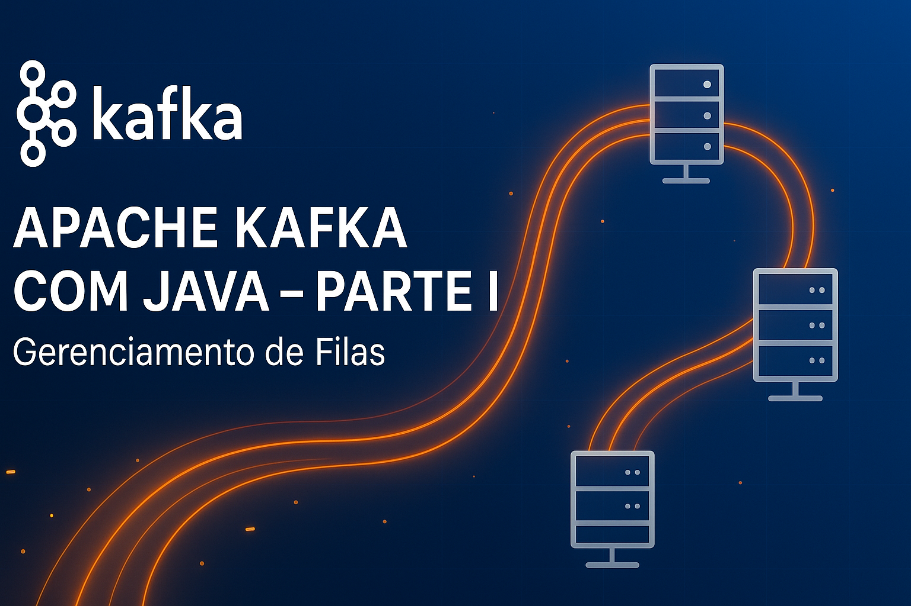

# Apache Kafka Java Mastery

Este repositório foi simplificado para facilitar o aprendizado e a consulta, focando em três partes principais:

## Estrutura do Conteúdo

- [Parte I: Fundamentos](parte1-fundamentos.md)  
    
  Conceitos essenciais do Apache Kafka, arquitetura, tópicos, partições, comandos básicos e primeiros experimentos.

- [Parte II: Java com Kafka](parte2-java.md)  
    
  Como integrar aplicações Java ao Kafka, producers, consumers, serialização, exemplos práticos e melhores práticas.

- [Parte Final: Avançado](parte-final-avancado.md)  
    
  Processamento avançado, Kafka Streams, integração com ecossistema, monitoramento, segurança e dicas para produção.

**Artefatos da Parte Final:**

- Exemplos de configuração de cluster Kafka com múltiplos brokers (`docker-compose.yml` avançado)
- Scripts de monitoramento com Prometheus e Grafana
- Arquivos de configuração de autenticação/autorização (SASL/SSL, ACLs)
- Exemplos de uso do Schema Registry (schemas Avro/Protobuf/JSON)
- Configurações de conectores para Kafka Connect
- Dashboards de monitoramento (JSON do Grafana)
- Scripts de backup/restauração e automação
- Checklists e documentação de boas práticas para produção

## Estrutura de Pastas

```markdown
kafka-java-mastery/
├── README.md
├── parte1-fundamentos.md
├── parte2-java.md
├── parte-final-avancado.md
├── LICENSE
├── img/
├── parte1-fundamentos/
│   └── docker-compose.yml
├── parte2-java/
│   ├── docker-compose.yml
│   ├── pom.xml
│   ├── src/
│   │   ├── main/
│   │   │   └── java/
│   │   │       └── com/
│   │   │           └── mulato/
│   │   │               ├── PedidoConsumer.java
│   │   │               └── PedidoProducer.java
│   │   └── test/
│   │       └── java/
│   │           └── com/
│   │               └── mulato/
│   │                   ├── PedidoConsumerTest.java
│   │                   └── PedidoProducerTest.java
│   └── target/
│       ├── parte2-java-1.0-SNAPSHOT.jar
│       └── ...
└── artefatos-final/
    ├── docker-compose-multibroker.yml
    ├── monitoramento/
    │   ├── prometheus.yml
    │   └── grafana-dashboard-example.json
    ├── seguranca/
    │   ├── server.properties
    │   └── exemplo-acls.txt
    ├── schema-registry/
    │   └── exemplo-schema-avro.avsc
    ├── kafka-connect/
    │   └── exemplo-connector.json
    ├── backup-e-automacao/
    │   └── backup-topicos.sh
    └── boas-praticas/
        └── checklist-producao.md
```

## Como usar

1. Siga a ordem das partes para evoluir do básico ao avançado.
2. Cada arquivo `.md` traz teoria, exemplos e comandos práticos.
3. Consulte o README sempre que quiser navegar entre as partes.

## Requisitos

- Java 11+ (recomendado Java 17+)
- Docker (para ambiente local)
- Git

## Licença

Este projeto está licenciado sob a MIT License.

## Recursos de Referência

- [Plano de Estudo Completo](doc/plano_estudo_java_kafka.md): roteiro detalhado de estudos, cronograma semanal, dicas de prática, recursos, troubleshooting e checklist de progresso.
- [Estrutura Completa de Repositório](doc/estrutura-github-completa.md): exemplo de organização profissional de pastas e arquivos, com sugestões para projetos maiores, colaboração e documentação.

Esses arquivos são opcionais e servem como apoio para quem deseja aprofundar ou expandir o treinamento.

---

Para dúvidas, sugestões ou contribuições, abra um issue ou envie um pull request.
